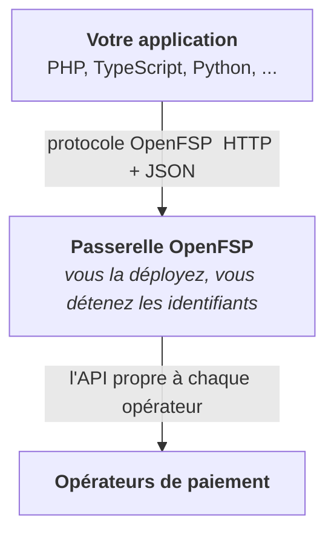

<picture>
  <source media="(prefers-color-scheme: dark)" srcset="https://cdn.openfsp.org/logo/openfsp-logo-inverse.svg">
  
</picture>

**Une norme ouverte pour l'interopérabilité des paiements en Haïti.**

[Spécification](https://github.com/openfspht/adrs) · [Architecture](https://github.com/openfspht/adrs/blob/main/text/0001-architecture-and-scope.md) · [Gouvernance](GOVERNANCE.md) · [Contribuer](CONTRIBUTING.md)

---

## Le problème

Haïti a des services de paiement numérique qui fonctionnent, et aucune interopérabilité
entre eux.

Chaque intégration marchande est écrite à partir de zéro, opérateur par opérateur. Les bacs
à sable des opérateurs permettent de tester un paiement qui réussit, mais pas de provoquer
un échec à volonté : les chemins de défaillance (expiration, refus, doublon, rappel tardif)
sont donc les moins testés, et ce sont ceux qui coûtent le plus cher quand ils sont mal
gérés. Ajouter un second opérateur, c'est écrire une seconde intégration. Et chaque langage
de programmation repaie l'addition en entier.

Il n'existe aucun contrat commun. Chacun négocie bilatéralement avec chacun, et le coût
total croît comme le nombre d'opérateurs **multiplié** par le nombre de consommateurs, au
lieu d'opérateurs **plus** consommateurs.

## Ce qu'est OpenFSP

Une spécification ouverte d'intégration marchande avec tous les opérateurs, une
passerelle auto-hébergée qui l'implémente, et des SDK clients minces. Une application a
ainsi une seule façon de parler à tous les opérateurs de paiement du marché.

L'intégration d'un opérateur est écrite **une seule fois**, dans la passerelle, et tous les
langages en bénéficient. Le pari architectural tient dans ce calcul : `O + L` au lieu de `O ×
L`.

## Ce que n'est pas OpenFSP

Ce sont des limites permanentes, pas la description d'un stade précoce.

- OpenFSP **ne détient ni ne déplace de fonds**. Il donne des instructions aux opérateurs ;
  il n'est jamais partie à une transaction.
- OpenFSP **n'exploite aucun service hébergé**. Vous déployez la passerelle ; le projet ne
  fait tourner rien du tout.
- OpenFSP **n'est pas un établissement de paiement agréé**, et ne remplace aucune licence
  ni aucun accord dont vous avez besoin auprès d'un opérateur.
- OpenFSP **n'est ni un commutateur ni un système de règlement**. Il normalise la façon
  dont un marchand donne une instruction à un opérateur : un problème plus petit, et un
  problème que l'on peut résoudre sans demander la permission à personne.

L'énoncé complet est dans la [spécification
d'architecture](https://github.com/openfspht/adrs/blob/main/spec/architecture.md#hors-périmètre).

## Composants

| Composant | Rôle | Statut |
|---|---|---|
| **Spécification** | Le protocole : modèle de données, cycle de vie, capacités, erreurs, idempotence, webhooks. Publiée dans [`adrs`](https://github.com/openfspht/adrs). | 🚧 Brouillon |
| **Passerelle** (Kotlin, Spring Boot) | Serveur auto-hébergé : protocole OpenFSP en entrée, API des opérateurs en sortie. | 📋 Prévu |
| **Serveur simulé** (Kotlin, Spring Boot) | Imite les opérateurs réels, modes de défaillance compris, pour développer et tester sans compte marchand. | 📋 Prévu |
| **SDK** (TypeScript, PHP, Python) | Clients minces du protocole. Le SDK est un confort : le HTTP brut fonctionne toujours. | 📋 Prévu |
| **Suite de conformité** | Exécutable par une machine : le rapport de conformité est reproductible par quiconque. | 📋 Prévu |

## Statut

**Spécification en brouillon, à ne pas utiliser en production.**

Le projet commence par stabiliser le protocole par le processus ADR, au grand jour, avant
d'écrire du code qu'il serait coûteux de défaire. L'implémentation suit : serveur simulé et
suite de conformité, puis passerelle.

Suivre ou infléchir ce travail : [`adrs`](https://github.com/openfspht/adrs).

## Engagements de conception

Quelques décisions qui lient tout le travail de spécification à venir. Le détail est dans la
[spécification
d'architecture](https://github.com/openfspht/adrs/blob/main/spec/architecture.md#principes-de-conception).

- **Les capacités s'activent explicitement, et rien n'est jamais simulé.** Le contrat de base
  est minimal : créer, lire et synchroniser un paiement. Le remboursement, la capture,
  l'annulation, le transfert et le reste sont annoncés séparément. Une opération qu'un
  opérateur ne sait pas faire est *absente et découvrable comme absente*, jamais émulée. Un
  remboursement émulé se découvre au moment où quelqu'un attend son argent.
- **Un montant est un entier d'unités mineures avec une devise explicite.** Jamais un
  flottant.
- **Toute création est idempotente.** Le réseau tombe après l'arrivée de
  la requête et avant le retour de la réponse. Un client qui ne peut pas réessayer sans risque
  va débiter deux fois ou perdre un paiement ; il n'y a pas de troisième issue.
- **La référence propre au marchand sert de clé de corrélation**, pour que le rapprochement
  reste possible après une expiration.
- **Les erreurs sont neutres vis-à-vis de l'opérateur, et l'erreur d'origine est conservée.**
  La neutralité seule est intraçable ; le renvoi brut seul est improgrammable.
- **Le comportement n'est jamais dégradé en silence.** Pas de bascule automatique, pas de
  succès partiel présenté comme un succès.

## Bâti sur des normes existantes

Détails d'erreur RFC 9457 · horodatages RFC 3339 · devises ISO 4217 · numéros de téléphone
E.164 · UUID RFC 9562 · signatures de messages HTTP RFC 9421 · OpenAPI 3.1 pour la description d'API, publiée avec
l'implémentation.

OpenFSP définit le moins de choses possible et réutilise le reste. Voir la [spécification
d'architecture](https://github.com/openfspht/adrs/blob/main/spec/architecture.md#normes), qui
explique aussi la relation avec la GSMA Mobile Money API, ISO 20022 et Mojaloop.

## Gouvernance et licence

OpenFSP est porté par [Karako Systems](https://karakosystems.com) et publié sous licence
**Apache-2.0** : la spécification, la passerelle, le serveur simulé, les SDK et la suite de
conformité, sans exception.

Il n'y a **aucun accord de licence de contributeur**. Vous conservez votre droit d'auteur,
rien n'est cédé à personne, et il en découle structurellement que le projet ne peut pas
être refermé plus tard. Les contributions sont certifiées par le [DCO](DCO).

Le porteur construit des produits commerciaux sur OpenFSP et le dit clairement. Ce que cela
implique en pratique (aucune voie privilégiée, aucune extension non documentée, motivation
déclarée sur toute ADR poussée par un besoin du porteur) est écrit dans
[GOVERNANCE.md §2](GOVERNANCE.md#2-intérêt-déclaré), avec les conditions engagées d'avance
d'ouverture de la gouvernance à un comité de pilotage.

## Contribuer

Le projet est jeune, et c'est le meilleur moment pour l'influencer. Un signalement
d'ambiguïté sur une ADR en brouillon vaut plus aujourd'hui qu'une pull request ne vaudra
plus tard.

Commencez par [CONTRIBUTING.md](CONTRIBUTING.md) et le
[processus ADR](https://github.com/openfspht/adrs). La participation est régie par le
[code de conduite](CODE_OF_CONDUCT.md).

Failles de sécurité : **n'ouvrez pas de ticket public**, voir [SECURITY.md](SECURITY.md).

## Pour les opérateurs de paiement et les régulateurs

Si vous exploitez un service de paiement, ou si vous en supervisez un, la [spécification
d'architecture](https://github.com/openfspht/adrs/blob/main/spec/architecture.md) est écrite
pour vous autant que pour les développeurs, en particulier ses [considérations
réglementaires](https://github.com/openfspht/adrs/blob/main/spec/architecture.md#considérations-réglementaires)
et ses [cibles de
conformité](https://github.com/openfspht/adrs/blob/main/spec/architecture.md#conformité).

Un opérateur qui implémente OpenFSP nativement hérite sans frais de tous les SDK et de toutes
les intégrations déjà écrites pour lui.

La relecture, la critique et le soutien formel sont tous bienvenus par le processus ADR
public. Pour une conversation technique : **dev@karakosystems.com**.

---

Apache-2.0 · Bâti en Haïti, pour Haïti.

